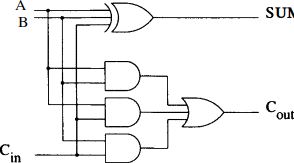

# RippleCarryFA
Structure of a Generic Ripple-Carry Full Adder written in VHDL. Testbench and diagrams included.

       

## Testing

While the following images show functionality, VHDL Assert statements were used to verify that all of the tests output matched expected output.  
  
[see the testbench](https://github.com/BarakBinyamin/RippleCarryFA/tree/main/tst), [download testbench](https://barakbinyamin.github.io/RippleCarryFA/tst/RippleCarryTB.vhd)  
[see the code](https://github.com/BarakBinyamin/RippleCarryFA/tree/main/src), [download Full_adder](https://barakbinyamin.github.io/RippleCarryFA/src/FullAdder.vhd), [downoad RippleCarryFA](https://barakbinyamin.github.io/RippleCarryFA/src/RippleCarryFA.vhd)  
  
 

   
 Figure 1: Behavioral Simulation Waveform

 

 Figure 2: Behavioral Simulation Waveform tests 0-4 
The SUM values in figure 2 show as unsigned Decimal.

  

 

 
Figure 3: Behavioral Simulation Waveform tests 5-9    
The SUM values Figure 3 show as signed Decimal. You may notice that 0-15 comes out to 1 in the waveform. This is because the smallest negative number a 4-bit signed number can make is -8. This problem could be avoided by optionally reading last carry.

## How it works

When we add two numbers on paper, we reapeat common steps:  
1. Line up the numbers by place significance
2. Add each a columb of numbers, passing the carry to the next columb  

#### How would one add a columb of bits? 
An addition unit can be derived by analyzing the desired outputs from each scenario of inputs  

                                   
|  A  |  B  |  Carry-in | SUM |  
| :-: | :-: | :-------: | :-: |  
|  0  |  0  |    0      |  0  |  
|  0  |  0  |    1      |  1  |  
|  0  |  1  |    0      |  1  |  
|  0  |  1  |    1      |  0  |  
|  1  |  0  |    0      |  1  |  
|  1  |  0  |    1      |  0  |  
|  1  |  1  |    0      |  0  |  
|  1  |  1  |    1      |  1  | 

|  A  |  B  |  Carry-in | Carry-out |
| :-: | :-: | :-------: | :-------: |
|  0  |  0  |    0      |     0     |
|  0  |  0  |    1      |     0     |
|  0  |  1  |    0      |     0     |
|  0  |  1  |    1      |     1     |
|  1  |  0  |    0      |     0     |
|  1  |  0  |    1      |     1     |
|  1  |  1  |    0      |     1     |
|  1  |  1  |    1      |     1     |

The truth tables show us:  
SUM = A xor B xor Carry-in  
Carry-out = AB or AC or BC = ((A xor B) and Carry-in)  

  

  

Diagram For An Addition Unit

  
    
The Ripple-Carry Adder works by passing the carry output to the next addition unit. [see diagram](https://github.com/BarakBinyamin/RippleCarryFA#RippleCarryFA)  
  
## References & Resources
[Image from mediaspace.illinois.edu/](https://mediaspace.illinois.edu/media/t/1_sy31lyo7/99753341)   
[Image from sciencedirect.com](https://www.sciencedirect.com/topics/computer-science/full-adder)    
Xilinx Vivado  
VHDL  
